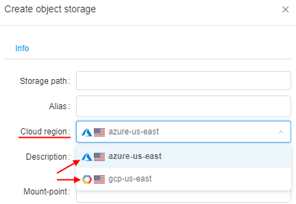
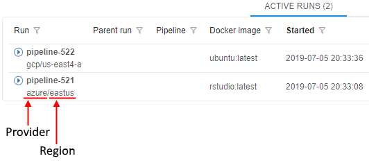

# Cloud Pipeline v.0.16 - Release notes

- [Google Cloud Platform Support](#google-cloud-platform-support)
- [Displaying Cloud Provider's icon](#displaying-cloud-providers-icon-for-the-storagecompute-resources)
- [Configurable timeout of GE Autoscale waiting](#configurable-timeout-of-ge-autoscale-waiting-for-a-worker-node-up)

***

- [Notable Bug fixes](#notable-bug-fixes)
    - [Worker nodes fail due to mismatch of the regions with the parent run](#worker-nodes-fail-due-to-mismatch-of-the-regions-with-the-parent-run)
    - [Detached configuration doesn't respect region setting](#detached-configuration-doesnt-respect-region-setting)
    - [Incorrect displaying of the "Start idle" checkbox](#incorrect-displaying-of-the-start-idle-checkbox)
    - [Limit check of the maximum cluster size is incorrect](#limit-check-of-the-maximum-cluster-size-is-incorrect)
    - [Incorrect behavior while download files from external resources into several folders](#incorrect-behavior-while-download-files-from-external-resources-into-several-folders)
    - [Detach configuration doesn't setup SGE for a single master run](#detach-configuration-doesnt-setup-sge-for-a-single-master-run)

***

## Google Cloud Platform Support

One of the major **`v0.16`** features is a support for the **[Google Cloud Platform](https://cloud.google.com/)**.

All the features, that were previously used for **`AWS`** and **`Azure`**, are now available in all the same manner, from all the same GUI/CLI, for **`GCP`**.

This provides an even greater level of a flexibility to launch different jobs in the locations, closer to the data, with cheaper prices or better compute hardware in depend on a specific task.

## Displaying Cloud Provider's icon for the storage/compute resources

As were presented in **[v0.15](../v.0.15/v.0.15_-_Release_notes.md#microsoft-azure-support)**, Cloud Pipeline can manage multi Cloud Providers in a single installation.

In the current version, useful icon-hints with the information about using Cloud Provider are introduced.  
If a specific platform deployment has a number of Cloud Providers registered (e.g. `AWS`+`Azure`, `GCP`+`Azure`) - corresponding icons/text information are displaying next to the cloud resource.

Such cloud resources are:

- **`Object/File Storages`** (icons in the **Library**, at the "DATA" panel of the **Dashboard** etc.)  
      
    
- **`Regions`** (icons in the **Cloud Regions** configuration, at the **Launch** form etc.)  
      
      
- **`Running jobs`**:
    - text hints (at the **RUNS** page)  
        
    - icons (at the **Run logs** page, at the "RUNS" panels of the **Dashboard**)  
          
        

> **Note**: this feature is not available for deployments with a **_single_** Cloud Provider.

## Configurable timeout of GE Autoscale waiting for a worker node up

Previously, `GE Autoscaler` waited for a worker node up for a fixed timeout. This could lead to incorrect behavior for specific **CLoud Providers**, because the timeout can be very different.

Current version extracts `GE Autoscaler` polling timeout to a new system preference **`ge.autoscaling.scale.up.polling.timeout`**.  
That preference defines how many seconds `GE Autoscaler` should wait for **pod initialization** and **run initialization**.  
Default value is `600` seconds (`10` minutes).

***

## Notable Bug fixes

### Worker nodes fail due to mismatch of the regions with the parent run

[#485](https://github.com/epam/cloud-pipeline/issues/485)

In certain cases, when a new child run was launching in cluster, cloud region was not specified directly and it might be created in a region differing from the parent run, that could lead to fails.  
Now, worker runs inherit parent's run cloud region.

### Detached configuration doesn't respect region setting

[#458](https://github.com/epam/cloud-pipeline/issues/458)

Region setting was not applied when pipeline is launched using detached configuration.  
Now, cloud region ID is merged into the detached configuration settings.

### Incorrect displaying of the "Start idle" checkbox

[#418](https://github.com/epam/cloud-pipeline/issues/418)

If for the configuration form with several tabs user was setting the **Start idle** checkbox on any tab and then switched between sub-configurations tabs - the "checked" state of the **Start idle** checkbox didn't change, even if **Cmd template** field was appearing with its value (these events are mutually exclusive).

### Limit check of the maximum cluster size is incorrect

[#412](https://github.com/epam/cloud-pipeline/issues/412)

Maximum allowed number of runs (size of the cluster) created at once is limited by system preference **`launch.max.scheduled.number`**. This check used strictly "less" check rather then "less or equal" to allow or deny cluster launch.  
Now, the "less or equal" check is used.

### Incorrect behavior while download files from external resources into several folders

[#373](https://github.com/epam/cloud-pipeline/issues/373)

If user was tried to download files from external resources and at the **Transfer settings** form was set **Create folders for each _path_ field** checkbox without setting any name field, all files downloaded into one folder without creating folders for each path field (column).

### Detach configuration doesn't setup SGE for a single master run

[#342](https://github.com/epam/cloud-pipeline/issues/342)

`Grid Engine` installation was mistakenly being skipped, if pipeline was launched with enabled system parameter **`CP_CAP_SGE`** via a detach configuration.
